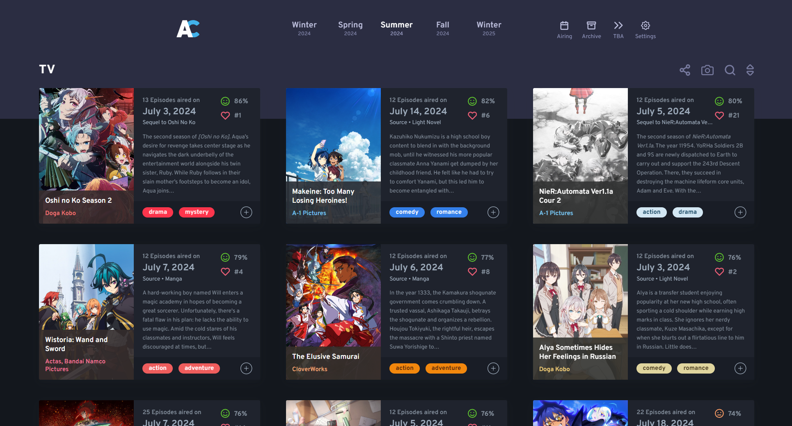
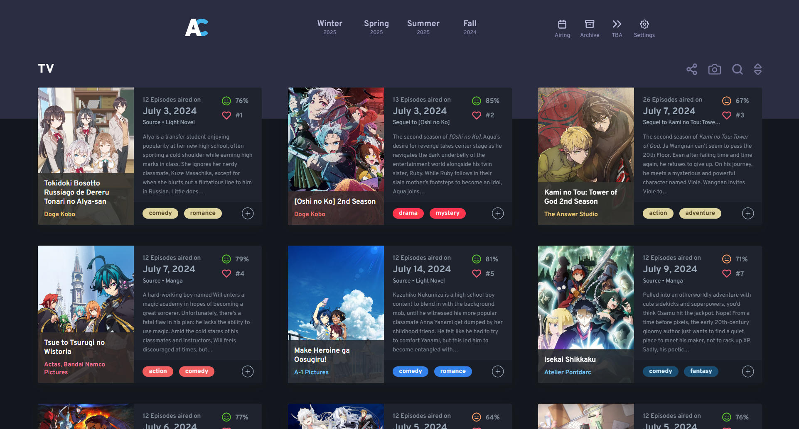

# anichart-better-seasons

Tempermonkey user script to change the way season links are rendered in [Anichart](https://anichart.net/). The currently selected season is made to always appear in the middle, with the 2 previous and next seasons on the left and right of it to allow for seamless browsing between seasons.

**How Anichart looks with this extension:**

Notice the season links at the top. Currently Summer 2024 is selected.

**Original:**

## How to install it?
1. Install [Tempermonkey](https://www.tampermonkey.net/) extension in your browser if you don't already have it.
2. Add a new user script in Tempermonkey and replace the content of it with the content of `anichart-better-seasons.js` file and make sure it is enabled.
3. (Optional) [Enable dev mode](https://www.tampermonkey.net/faq.php?locale=en#Q209) to allow user scripts to work on Chromium browsers.
